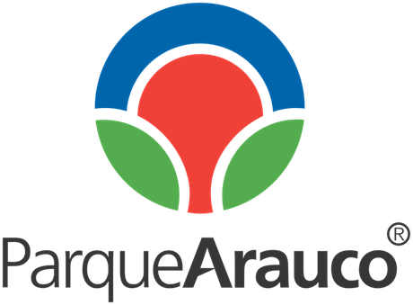

Parque Arauco CMS builded using [ReactJS](https://reactjs.org/)

## Description

The project use ReactJS 16.5 to develop parque arauco CMS, You can find ReactJS documentation [here](https://reactjs.org/).

## Enviroment Variables

The project use Environment variables to get different values like keys, custom parameters, etc.

Copy and rename `.env.example` to `.env` in the root folder of the project and add the values for the keys.

Example .env file :

```Bash
KEY_NAME=value
```

For staging and production most of the platforms like heroku or amazon provide User interface for add environment keys, otherwise if there is no way to add this it will be needed the .env file in the root of the project. Always check that the keys are not added to the repository.

### Keys

| Keys                     | Description              |
| ------------------------ | ------------------------ |
| REACT_APP_SITE_TITLE     | Application Title        |
| REACT_APP_API_URL        | API URL                  |
| REACT_APP_DEFAULT_LOCALE | Language by default (es) |
| PUBLIC_URL               | CMS URL                  |

## Installation

```bash
$ yarn install
```

## Running the app

```bash
# development
$ yarn start
```

## Test

```bash
# unit tests
$ yarn test

# unit tests report
$ yarn test:report
```

## Generating build

Builds the app for production to the `build` folder.
It correctly bundles React in production mode and optimizes the build for the best performance.

```bash
npm run build
```
